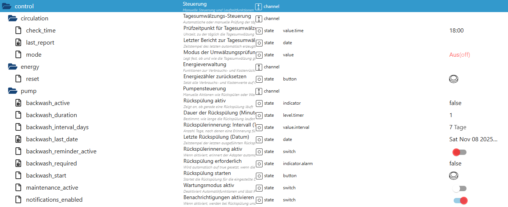

# Steuerung (control)

Der Bereich **`control`** enthält zentrale **manuelle Steuer-, Wartungs- und Verwaltungsfunktionen** des PoolControl-Adapters.  
Er dient dazu, automatische Abläufe gezielt zu beeinflussen, Wartungsphasen zu steuern und interne Zähler oder Prozesse auszulösen.

---

## Tagesumwälzungs-Steuerung (`control.circulation`)

### `control.circulation.mode`
**Modus der Umwälzungsprüfung**  
Legt fest, ob und wie die tägliche Umwälzung überwacht wird.  
Je nach Einstellung erfolgt die Prüfung automatisch oder ist deaktiviert.

---

### `control.circulation.check_time`
**Prüfzeitpunkt für Tagesumwälzung**  
Uhrzeit, zu der die tägliche Umwälzungsprüfung durchgeführt wird.

---

### `control.circulation.last_report`
**Letzter Bericht zur Tagesumwälzung**  
Zeitstempel des letzten automatisch erzeugten Prüfberichts.

---

## Energieverwaltung (`control.energy`)

### `control.energy.reset`
**Energiezähler zurücksetzen**  
Manueller Reset-Button zum Zurücksetzen aller Verbrauchs- und Kostenwerte.  
Wird z. B. nach einem Zählerwechsel oder zur Neuinitialisierung verwendet.

---

## Pumpensteuerung & Wartung (`control.pump`)

### `control.pump.backwash_active`
**Rückspülung aktiv**  
Zeigt an, ob aktuell eine Rückspülung läuft.

---

### `control.pump.backwash_start`
**Rückspülung starten**  
Manueller Start der Rückspülung für die konfigurierte Dauer.

---

### `control.pump.backwash_duration`
**Dauer der Rückspülung (Minuten)**  
Legt fest, wie lange eine Rückspülung ausgeführt wird.

---

### `control.pump.backwash_interval_days`
**Rückspülintervall (Tage)**  
Anzahl der Tage zwischen zwei Rückspül-Erinnerungen.

---

### `control.pump.backwash_last_date`
**Letzte Rückspülung (Datum)**  
Zeitstempel der zuletzt durchgeführten Rückspülung.

---

### `control.pump.backwash_required`
**Rückspülung erforderlich**  
Wird automatisch gesetzt, wenn das konfigurierte Rückspülintervall überschritten wurde.

---

### `control.pump.backwash_reminder_active`
**Rückspülerinnerung aktiv**  
Aktiviert oder deaktiviert die automatische Rückspülerinnerung.

---

### `control.pump.maintenance_active`
**Wartungsmodus aktiv**  
Aktiviert den Wartungsmodus.  
In diesem Zustand werden automatische Steuerungen pausiert, damit manuelle Arbeiten sicher durchgeführt werden können.

---

### `control.pump.notifications_enabled`
**Benachrichtigungen aktiv**  
Legt fest, ob bei Rückspülungen und Wartungsereignissen Benachrichtigungen ausgelöst werden.

---

## Hinweise

- Der Bereich **`control`** greift aktiv in den Systembetrieb ein.
- Er besitzt **Vorrang** gegenüber automatischen Helpern (z. B. Solar- oder Heat-Steuerung).
- Änderungen sollten bewusst vorgenommen werden, insbesondere im Wartungsmodus.

---
