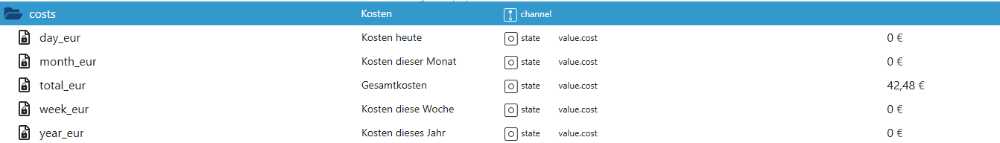

# Kosten (`costs`)

Der Bereich **Kosten** zeigt die berechneten Stromkosten für den Poolbetrieb.
Die Werte basieren auf dem gemessenen Stromverbrauch (`consumption.*`) und dem im Adapter
konfigurierten Strompreis.

Die Berechnung erfolgt automatisch durch den Adapter.

---

## Datenpunkte im Detail

### `costs.day_eur`
**Kosten heute**  
Zeigt die bisher angefallenen Stromkosten des aktuellen Tages in Euro.

- Typ: `value.cost`
- Einheit: €
- Wird täglich um Mitternacht automatisch zurückgesetzt

---

### `costs.week_eur`
**Kosten diese Woche**  
Summiert die Stromkosten der laufenden Kalenderwoche.

- Typ: `value.cost`
- Einheit: €
- Automatische Wochenlogik (keine manuelle Rücksetzung nötig)

---

### `costs.month_eur`
**Kosten dieses Monat**  
Gesamte Stromkosten des aktuellen Monats.

- Typ: `value.cost`
- Einheit: €
- Monatsweise automatische Fortschreibung

---

### `costs.year_eur`
**Kosten dieses Jahr**  
Summierte Stromkosten des laufenden Jahres.

- Typ: `value.cost`
- Einheit: €
- Dient zur langfristigen Kostenübersicht

---

### `costs.total_eur`
**Gesamtkosten**  
Gesamtsumme aller erfassten Stromkosten seit Inbetriebnahme bzw. seit letztem Reset
des Verbrauchssystems.

- Typ: `value.cost`
- Einheit: €
- Wird nicht automatisch zurückgesetzt
- Referenzwert für Langzeitbetrachtungen

---

## Hinweise

- Die Kostenwerte werden **nicht direkt gemessen**, sondern aus dem Stromverbrauch
  (`consumption.*`) und dem eingestellten Strompreis berechnet.
- Änderungen am Strompreis wirken sich **nur auf zukünftige Berechnungen** aus.
- Ein Reset der Verbrauchsdaten beeinflusst entsprechend auch die Kostenwerte.

