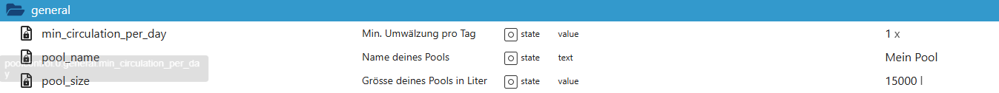

# Allgemein (`general`)

Der Bereich **Allgemein** enthält grundlegende Stammdaten und Basisparameter
für den Poolbetrieb.  
Diese Datenpunkte bilden die Grundlage für Berechnungen in anderen Bereichen
(z. B. Umwälzung, Laufzeit, Statistik).

---

## Datenpunkte im Detail

### `general.pool_name`
**Name deines Pools**  
Freitext-Name des Pools.  
Wird für Anzeigen, Texte, Statusmeldungen und Zusammenfassungen verwendet.

- Typ: `text`
- Beispiel: `Mein Pool`
- Rein informativ, keine Steuerfunktion

---

### `general.pool_size`
**Größe deines Pools in Liter**  
Gesamtvolumen des Pools in Litern.

- Typ: `value`
- Einheit: Liter
- Grundlage für:
  - Umwälzungsberechnung
  - Tages-Soll-Umwälzung
  - Statistik- und Analysefunktionen

---

### `general.min_circulation_per_day`
**Minimale Umwälzung pro Tag**  
Gibt an, wie oft das gesamte Poolvolumen mindestens pro Tag umgewälzt werden soll.

- Typ: `value`
- Einheit: `x` (Anzahl Umwälzungen)
- Wird verwendet für:
  - Berechnung der täglichen Soll-Umwälzmenge
  - Vergleich „Ist vs. Soll“ im Umwälzungs- und Statistikbereich

---

## Hinweise

- Änderungen an diesen Werten wirken sich **direkt auf Berechnungen** in anderen
  Bereichen aus (z. B. Umwälzung, Statistik).
- Die Datenpunkte sind **persistiert** und bleiben bei Neustarts oder Updates erhalten.
- Es findet **keine automatische Plausibilitätsprüfung** statt – korrekte Werte
  liegen in der Verantwortung des Nutzers.

