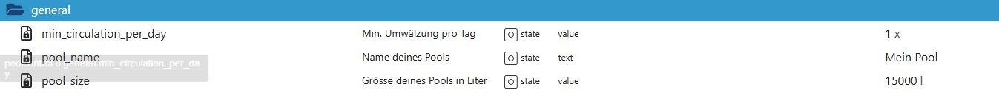

# Allgemein (`general`)

Der Bereich **Allgemein** enthält grundlegende Stammdaten und Basisparameter
für den Poolbetrieb.  
Diese Datenpunkte bilden die Grundlage für Berechnungen in anderen Bereichen
(z. B. Umwälzung, Laufzeit, Statistik).

---

## Datenpunkte im Detail

### `general.pool_name`
**Name deines Pools**  
Freitext-Name des Pools.  
Wird für Anzeigen, Texte, Statusmeldungen und Zusammenfassungen verwendet.

- Typ: `text`
- Beispiel: `Mein Pool`
- Rein informativ, keine Steuerfunktion

---

### `general.pool_size`
**Größe deines Pools in Liter**  
Gesamtvolumen des Pools in Litern.

- Typ: `value`
- Einheit: Liter
- Grundlage für:
  - Umwälzungsberechnung
  - Tages-Soll-Umwälzung
  - Statistik- und Analysefunktionen

---

### `general.min_circulation_per_day`
**Minimale Umwälzung pro Tag**  
Gibt an, wie oft das gesamte Poolvolumen mindestens pro Tag umgewälzt werden soll.

- Typ: `value`
- Einheit: `x` (Anzahl Umwälzungen)
- Beschreibbar und persistent
- Gültiger Wertebereich: `0.5` bis `3.0`
- Der Admin-Wert dient nur als Initialwert bei erster Einrichtung oder bei leerem/ungültigem State
- Wird verwendet für:
  - Berechnung der täglichen Soll-Umwälzmenge
  - Vergleich „Ist vs. Soll“ im Umwälzungs- und Statistikbereich
  - Aktualisierung von `circulation.daily_required` und `circulation.daily_remaining`

---

### `general.min_circulation_effective_per_day`
**Wirksame minimale Umwälzung pro Tag**
Zeigt den aktuell verwendeten Umwälzfaktor. Bei aktivem Temperaturfaktor entspricht er dem Basiswert plus Zusatzfaktor, maximal jedoch `3.0`.

- Typ: `value`
- Einheit: `x`
- Nur lesbar und persistent
- `general.min_circulation_per_day` bleibt dabei unverändert

### `general.min_circulation_effective_reason`
**Grund für den wirksamen Umwälzfaktor**
Enthält einen stabilen technischen Status wie `base`, `temperature_factor_active`, `temperature_factor_capped`, `sensor_inactive` oder `temperature_missing`.

---

## Hinweise

- Änderungen an diesen Werten wirken sich **direkt auf Berechnungen** in anderen
  Bereichen aus (z. B. Umwälzung, Statistik).
- Die Datenpunkte sind **persistiert** und bleiben bei Neustarts oder Updates erhalten.
- `general.min_circulation_per_day` wird auf den Bereich `0.5` bis `3.0` plausibilisiert.
  Leere oder ungültige Werte werden auf den Admin-Initialwert zurückgesetzt.
