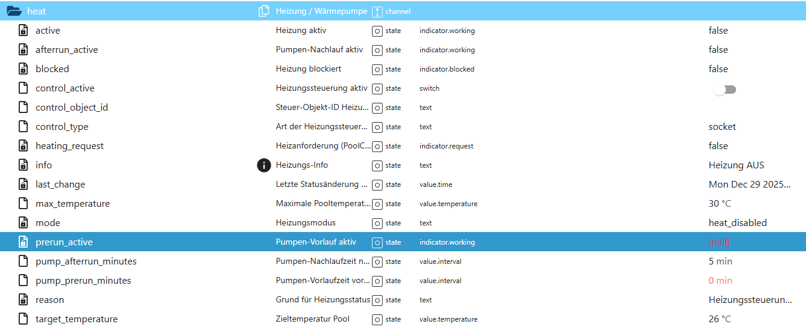

# Heizungssteuerung (HeatHelper)

Der **HeatHelper** erweitert PoolControl um eine intelligente Heizungs- bzw. Wärmepumpensteuerung.  
Er steuert Heizgeräte **temperaturabhängig**, **ereignisbasiert** und **sicher priorisiert** gegenüber anderen Automatikfunktionen.

Die Heizungslogik arbeitet **rein unterstützend** und greift nur dann ein, wenn alle Rahmenbedingungen erfüllt sind.

---

## Funktionsübersicht

Der HeatHelper:

- steuert **Heizstab oder Wärmepumpe**
- arbeitet **nur im Automatikmodus**
- berücksichtigt den **Saisonstatus**
- wird bei **Wartungsmodus** vollständig blockiert (Vorrang ControlHelper)
- schaltet die **Pumpe automatisch zu**, wenn sie für den Heizbetrieb benötigt wird
- unterstützt eine **Pumpen-Nachlaufzeit**
- schützt vor Konflikten durch **Ownership-Logik**
- kann auch für **separate Heizkreise / zweite Pumpe** genutzt werden

---

## Typische Einsatzszenarien

- Heizstab direkt im Pool
- Wärmepumpe mit eigener Steuersteckdose
- Zweiter Pumpenkreis für Wärmetauscher
- Externer Heizkreis mit separater Umwälzpumpe

👉 Der HeatHelper steuert **nicht zwangsläufig die Hauptpumpe**, sondern kann gezielt einen **eigenen Heizkreis** ansteuern.

---

## Datenpunkte – Übersicht

*(Screenshot im Repository unter `docs/states/images/` ablegen)*

---

## Erklärung der Datenpunkte

### 🔹 Steuerung & Status

#### `heat.control_active`
Aktiviert oder deaktiviert die komplette Heizungssteuerung.

- `true` → Heizungslogik aktiv  
- `false` → Heizung vollständig deaktiviert

---

#### `heat.active`
Zeigt an, ob der HeatHelper aktuell aktiv arbeitet.

- `true` → Heizlogik aktiv  
- `false` → keine aktive Heizsteuerung

---

#### `heat.blocked`
Zeigt, ob die Heizung aktuell blockiert ist.

Typische Blockierungsgründe:
- Saison inaktiv
- Wartungsmodus aktiv
- Pumpenmodus ≠ Automatik
- keine gültige Pooltemperatur

---

#### `heat.mode`
Interner Betriebszustand des HeatHelpers.

Beispiele:
- `heating` → Heizen aktiv  
- `afterrun` → Pumpen-Nachlauf läuft  
- `off` → Heizung aus  
- `maintenance_active` → blockiert durch Wartung  
- `mode_not_auto` → blockiert (Pumpenmodus)

---

#### `heat.reason`
Menschenlesbare Begründung für den aktuellen Zustand.

Beispiele:
- „Heizen: Pool 24.3 °C < Ziel 26 °C“
- „Ziel erreicht: Pool ≥ Zieltemperatur“
- „Wartungsmodus aktiv“

---

#### `heat.info`
Zusätzliche technische Informationen (z. B. Steuerart, Ziel-ID).

Rein informativ, keine Steuerfunktion.

---

### 🔹 Temperaturparameter

#### `heat.target_temperature`
Zieltemperatur des Pools in °C.

Unterschreitet die Pooltemperatur diesen Wert, wird geheizt.

---

#### `heat.max_temperature`
Sicherheitsabschaltung.

Wird diese Temperatur erreicht oder überschritten, wird die Heizung **sofort deaktiviert** – unabhängig vom Zielwert.

---

### 🔹 Heizanforderung (intern)

#### `heat.heating_request`
Reines **Signalsystem**.

- `true` → Heizbedarf vorhanden  
- `false` → kein Heizbedarf  

Dieser State kann von:
- Visualisierungen
- Diagnose-Modulen
- externen Scripten  

ausgewertet werden, **ohne aktiv einzugreifen**.

---

### 🔹 Pumpenlogik & Nachlauf

#### `heat.pump_afterrun_minutes`
Definiert die Nachlaufzeit der Pumpe in Minuten, nachdem die Heizung abgeschaltet wurde.

- `0` → kein Nachlauf  
- `>0` → Pumpe läuft entsprechend weiter

---

#### `heat.afterrun_active`
Zeigt an, ob sich der HeatHelper aktuell im Pumpen-Nachlauf befindet.

---

### 🔹 Steuerobjekt (Heizung)

#### `heat.control_type`
Legt fest, wie das Heizgerät angesteuert wird.

Typische Werte:
- `socket` → schaltbare Steckdose
- `boolean` → boolescher Steuer-State

---

#### `heat.control_object_id`
Objekt-ID des zu steuernden Heizgeräts.

Beispiele:
- Steckdose der Wärmepumpe
- Relais eines Heizstabs
- externer Steuer-State

---

## Prioritäten & Sicherheit

Der HeatHelper:

- arbeitet **nur im Automatikmodus**
- wird **sofort blockiert**, wenn der Wartungsmodus aktiv ist
- schaltet die Pumpe **nur dann aus**, wenn er sie selbst eingeschaltet hat
- erzeugt **keine Endlosschleifen**
- arbeitet vollständig **eventbasiert**

---

## Hinweis für Nutzer mit zweiter Pumpe

Der HeatHelper kann **unabhängig von der Hauptpumpe** genutzt werden.

Beispiel:
- Hauptpumpe → Poolumwälzung  
- Zweite Pumpe → Wärmetauscher / Heizkreis  

Damit lassen sich auch komplexere Anlagen **ohne zusätzliche Scripte** sauber abbilden.

---

## Fazit

Der HeatHelper erweitert PoolControl um eine **robuste, sichere und flexible Heizungssteuerung**,  
die sowohl für einfache Heizstäbe als auch für komplexe Heizkreise geeignet ist –  
vollständig integriert in das bestehende Helper- und Prioritätssystem.
