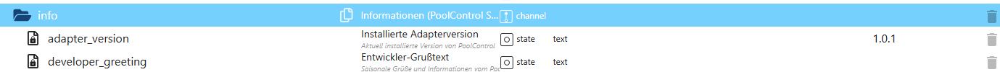

# Informationsbereich (InfoHelper)

Der **InfoHelper** stellt zentrale **Informations- und Meta-Daten** des PoolControl-Adapters bereit.  
Dieser Bereich dient **ausschließlich der Anzeige** und enthält **keine Steuer- oder Logikfunktionen**.

Die Datenpunkte im Bereich `info.*` liefern grundlegende Informationen über:
- die installierte Adapterversion
- Entwickler- und Projektinformationen
- optionale Begrüßungs- oder Hinweistexte

---

## Zweck des Info-Bereichs

Der Info-Bereich:

- bietet **transparente Adapterinformationen**
- eignet sich für **VIS-Anzeigen, Dashboards oder Diagnose-Ansichten**
- ist **read-only**
- verändert **niemals** den Betriebszustand des Systems
- kann jederzeit gefahrlos ausgelesen werden

👉 Der InfoHelper greift **nicht** in die Steuerlogik ein und besitzt **keine Priorität** gegenüber anderen Modulen.

---

## Datenpunkte – Übersicht

*(Screenshot im Repository unter `docs/states/images/info.png` ablegen)*

---

## Erklärung der Datenpunkte

### 🔹 Allgemeine Informationen

#### `info.adapter_version`
Zeigt die aktuell installierte Version des PoolControl-Adapters an.

- Typ: `string`
- Beispiel: `1.0.1`

Dieser Datenpunkt eignet sich besonders für:
- Diagnose-Ansichten
- Support-Anfragen
- VIS-Header oder Infoseiten

---

#### `info.developer_greeting`
Enthält einen Entwickler- oder Projekt-Grußtext.

Typische Inhalte:
- saisonale Hinweise
- kurze Projektinformationen
- persönliche Begrüßung vom Entwickler

Beispiel:
> „Willkommen bei PoolControl – viel Spaß in der Poolsaison!“

Dieser Text ist **rein informativ** und kann frei angezeigt oder ignoriert werden.

---

## Eigenschaften & Sicherheit

Alle Datenpunkte im Bereich `info.*` sind:

- **read-only**
- **nicht persistent steuernd**
- **ungefährlich für den Betrieb**
- **nicht abhängig vom Saisonstatus**
- **nicht an Automatik- oder Wartungslogik gebunden**

Eine Änderung oder das Auslesen dieser Datenpunkte hat **keinen Einfluss** auf:
- Pumpe
- Heizung
- Solar
- Zeitsteuerung
- Sicherheitsfunktionen

---

## Typische Anwendungsfälle

- Anzeige der Adapterversion im Dashboard
- Infoseite in VIS / VIS-2
- Diagnose- oder Support-Screenshots
- Begrüßungstext für neue Nutzer
- zentrale Projektinformation innerhalb der Visualisierung

---

## Fazit

Der InfoHelper stellt einen **stabilen, sicheren und rein informativen Bereich** innerhalb von PoolControl bereit.  
Er dient der Transparenz, Benutzerfreundlichkeit und Diagnose –  
**ohne** Einfluss auf die eigentliche Poolsteuerung.
