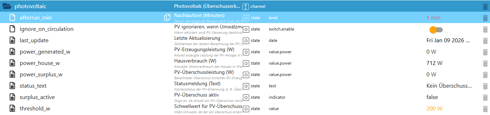

# Photovoltaik-Überschusssteuerung (PhotovoltaicHelper)

Der **PhotovoltaicHelper** erweitert PoolControl um eine intelligente **PV-Überschusserkennung**.  
Er erkennt überschüssige Solarleistung und stellt diese Information zentral für andere Module (z. B. Pumpen- oder Heizlogik) bereit.

Die Photovoltaik-Logik ist **rein informativ und auswertend** –  
sie **schaltet keine Aktoren direkt**, sondern liefert klare, sichere Status- und Leistungsdaten.

---

## Funktionsübersicht

Der PhotovoltaicHelper:

- wertet **PV-Erzeugung**, **Hausverbrauch** und **Überschuss** aus
- berechnet die aktuelle **PV-Überschussleistung**
- erkennt zuverlässig, ob ein **relevanter Überschuss** vorliegt
- stellt einen klaren **Status-Text** bereit
- kann bei aktiver Umwälzung **bewusst ignoriert** werden
- unterstützt eine **Nachlaufzeit**, um kurzes Takten zu vermeiden
- arbeitet vollständig **eventbasiert**

👉 Die eigentliche Nutzung des PV-Überschusses (z. B. Pumpe länger laufen lassen)  
erfolgt **in anderen Helpern**, nicht hier.

---

## Typische Einsatzszenarien

- Poolpumpe läuft länger bei PV-Überschuss
- Wärmepumpe nutzt bevorzugt Solarstrom
- Anzeige von PV-Status im Dashboard
- Entscheidungsgrundlage für Automatik-Logiken
- Diagnose von Solar- und Verbrauchsdaten

---

## Datenpunkte – Übersicht

*(Screenshot im Repository unter `docs/states/images/photovoltaic.png` ablegen)*

---

## Erklärung der Datenpunkte

### 🔹 Leistungswerte

#### `photovoltaic.power_generated_w`
Aktuell erzeugte Leistung der PV-Anlage in Watt.

- Typ: `number`
- Einheit: `W`

---

#### `photovoltaic.power_house_w`
Aktueller Stromverbrauch des Hauses in Watt.

- Typ: `number`
- Einheit: `W`

---

#### `photovoltaic.power_surplus_w`
Berechnete PV-Überschussleistung in Watt.

Berechnung:

PV-Erzeugung – Hausverbrauch

- positiver Wert → Überschuss vorhanden
- `0` oder negativ → kein Überschuss

---

### 🔹 Überschusserkennung

#### `photovoltaic.threshold_w`
Schwellwert in Watt, ab dem ein PV-Überschuss als relevant gilt.

Beispiel:
- `200 W` → Überschuss wird ab 200 W erkannt

---

#### `photovoltaic.surplus_active`
Zentraler Status der Überschusserkennung.

- `true` → relevanter PV-Überschuss vorhanden
- `false` → kein oder zu geringer Überschuss

Dieser State wird von anderen Helpern ausgewertet,  
z. B. für Pumpen- oder Heizungslogiken.

---

#### `photovoltaic.status_text`
Menschenlesbare Statusmeldung zur PV-Situation.

Beispiele:
- „PV-Überschuss aktiv“
- „Kein Überschuss verfügbar“
- „PV-Erzeugung zu gering“

Ideal für:
- VIS-Anzeigen
- Dashboards
- Diagnose-Ansichten

---

### 🔹 Zeit- & Schutzlogik

#### `photovoltaic.afterrun_min`
Nachlaufzeit in Minuten, nachdem ein PV-Überschuss endet.

Zweck:
- verhindert kurzes Ein-/Ausschalten
- sorgt für ruhige, stabile Automatik

---

#### `photovoltaic.ignore_on_circulation`
Option zum bewussten Ignorieren der PV-Logik bei aktiver Umwälzung.

- `true` → PV-Überschuss wird ignoriert, solange Umwälzung aktiv ist
- `false` → PV-Logik immer aktiv

Typischer Anwendungsfall:
- Mindestumwälzung soll nicht durch PV-Logik beeinflusst werden

---

#### `photovoltaic.last_update`
Zeitstempel der letzten Aktualisierung der PV-Berechnung.

- Typ: `date`
- rein informativ
- hilfreich für Diagnose und Monitoring

---

## Eigenschaften & Sicherheit

Der PhotovoltaicHelper:

- schaltet **keine Geräte direkt**
- erzeugt **keine Endlosschleifen**
- arbeitet **ereignisbasiert**
- ist **unabhängig vom Saisonstatus**
- beeinflusst andere Module **nur über saubere Status-States**

Alle Entscheidungen bleiben nachvollziehbar und transparent.

---

## Zusammenspiel mit anderen Modulen

Der PhotovoltaicHelper liefert Daten an:

- Pumpen-Logik (PV-optimierter Betrieb)
- Heizungs- / Wärmepumpen-Logik
- Statistik- und Analyse-Module
- Visualisierungen und Dashboards

👉 Er ist damit ein **zentrales Informationsmodul**,  
aber **kein Steuer-Master**.

---

## Fazit

Der PhotovoltaicHelper stellt eine **zuverlässige, saubere und sichere PV-Überschusserkennung** bereit.  
Er bildet die Grundlage für **energieoptimierte Pool-Automatik**,  
ohne dabei selbst in Steuerentscheidungen einzugreifen.

Ein klarer Baustein für nachhaltigen und intelligenteren Poolbetrieb.
