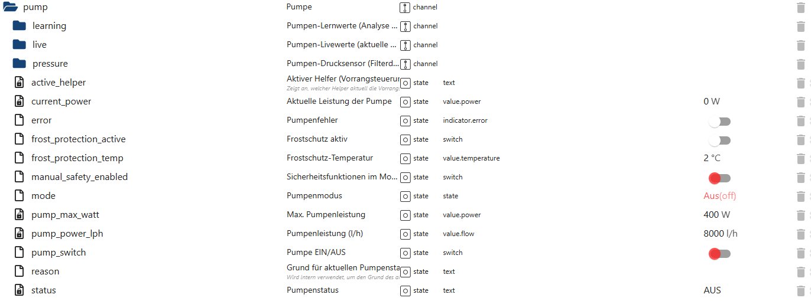

# Pumpensteuerung (pump)

Der Bereich **`pump`** bildet die **zentrale Steuer-, Status- und Koordinationsstelle** für die Poolpumpe.  
Alle automatischen und manuellen Pumpenfunktionen laufen hier zusammen.

👉 Wichtig:  
Der `pump`-Bereich steuert **nicht selbstständig**, sondern koordiniert und priorisiert  
die Entscheidungen verschiedener Helper (z. B. Zeit, Solar, Frost, Heizung, Wartung).

---

## Struktur des Pumpenbereichs

Der Pumpenbereich gliedert sich in mehrere Unterbereiche:

- `pump.live` → aktuelle Livewerte der Pumpe  
- `pump.learning` → erlernte Referenz- und Analysewerte  
- `pump.pressure` → Filterdruck-Überwachung inkl. Lernsystem  

Diese Unterbereiche sind **rein auswertend**.  
Die eigentliche **Schaltentscheidung** erfolgt zentral im Hauptbereich `pump`.

---

## Datenpunkte – Übersicht

*(Screenshot im Repository unter `docs/states/images/pump.png` ablegen)*

---

## Erklärung der Datenpunkte

## 🔹 Steuerung & Modus

#### `pump.mode`
Aktueller Betriebsmodus der Pumpe.

Typische Werte:
- `off` → Pumpe aus  
- `auto` → Automatikbetrieb  
- `manual` → manuelle Steuerung  
- `time` → Zeitsteuerung aktiv  
- `maintenance` → Wartungsmodus  

Der Modus bestimmt, **welche Helper Einfluss nehmen dürfen**.

---

#### `pump.pump_switch`
Zentraler Schaltzustand der Pumpe.

- `true` → Pumpe EIN  
- `false` → Pumpe AUS  

Dieser State wird **intern** von den Helpern gesetzt  
oder manuell im entsprechenden Modus.

---

## 🔹 Status & Priorisierung

#### `pump.active_helper`
Zeigt an, **welcher Helper aktuell Vorrang** hat.

Beispiele:
- `timeHelper`
- `solarHelper`
- `heatHelper`
- `frostHelper`
- `controlHelper`

Dieser State ist entscheidend für:
- Nachvollziehbarkeit
- Diagnose
- Visualisierung

---

#### `pump.reason`
Menschenlesbare Begründung für den aktuellen Pumpenzustand.

Beispiele:
- „Zeitsteuerung aktiv“
- „Solarbetrieb – PV-Überschuss“
- „Frostschutz aktiv“
- „Wartungsmodus“

---

#### `pump.status`
Zusammenfassender Pumpenstatus als Text.

Beispiele:
- `EIN`
- `AUS`
- `EIN (Solar)`
- `EIN (Heizung)`
- `EIN (Frostschutz)`

Ideal für:
- Dashboards
- VIS-Statusanzeigen
- Sprachassistenten

---

## 🔹 Leistungsparameter

#### `pump.pump_max_watt`
Konfigurierte maximale elektrische Leistung der Pumpe in Watt.

Dient als Referenz für:
- Durchflussberechnung
- Prozentuale Auslastung
- Lern- und Statistikfunktionen

---

#### `pump.pump_power_lph`
Konfigurierte maximale Pumpenleistung in Liter pro Stunde.

Dieser Wert wird verwendet, um:
- reale Durchflusswerte zu berechnen
- Umwälzungszeiten zu bestimmen

---

#### `pump.current_power`
Aktuelle elektrische Leistungsaufnahme der Pumpe in Watt.

- `0 W` → Pumpe aus  
- `>0 W` → Pumpe läuft  

Wird typischerweise von einer Messsteckdose geliefert.

---

## 🔹 Sicherheitsfunktionen

#### `pump.error`
Signalisiert einen Pumpenfehler.

- `true` → Fehler erkannt  
- `false` → kein Fehler  

Der Fehler kann von:
- internen Prüfungen
- externen Sensoren
- Diagnosemodulen

gesetzt werden.

---

#### `pump.manual_safety_enabled`
Aktiviert zusätzliche Sicherheitsfunktionen im manuellen Modus.

Zweck:
- Schutz vor Fehlbedienung
- Vermeidung unbeabsichtigten Dauerbetriebs

---

## 🔹 Frostschutz

#### `pump.frost_protection_active`
Zeigt an, ob der Frostschutz aktuell aktiv ist.

---

#### `pump.frost_protection_temp`
Temperaturschwelle für den Frostschutz.

Unterschreitet die gemessene Temperatur diesen Wert,  
kann die Pumpe automatisch eingeschaltet werden.

---

## Eigenschaften & Sicherheit

Der Pumpenbereich:

- arbeitet **ereignisbasiert**
- priorisiert Helper eindeutig
- verhindert **Endlosschleifen**
- schaltet die Pumpe **nur gezielt**
- ist vollständig **rückverfolgbar**
- trennt **Steuerung, Status und Analyse**

---

## Zusammenspiel mit Unterbereichen

- `pump.live` → liefert aktuelle Messwerte  
- `pump.learning` → bewertet den Normalbetrieb  
- `pump.pressure` → überwacht Filterdruck & Trends  

Der Hauptbereich `pump` **verwendet diese Informationen**,  
trifft aber **keine Annahmen**, sondern reagiert ausschließlich auf klare Zustände.

---

## Typische Anwendungsfälle

- Zentrale Pumpensteuerung
- Visualisierung des Pumpenstatus
- Diagnose bei unerwartetem Verhalten
- Nachvollziehen von Automatikentscheidungen
- Integration in Sprachassistenten

---

## Fazit

Der Bereich **`pump`** ist das **Herz der PoolControl-Automatik**.  
Er koordiniert alle Pumpenentscheidungen transparent, sicher und nachvollziehbar –  
und verbindet Live-Daten, Lernwerte und Sicherheitslogik zu einem stabilen Gesamtsystem.
