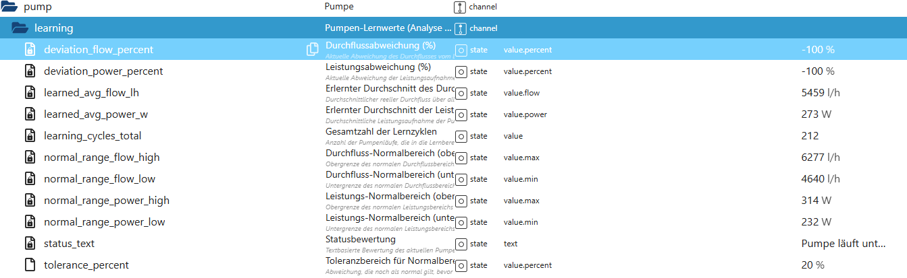

# Pumpen-Lernwerte & Analyse (pump.learning)

Der Bereich **`pump.learning`** enthält alle **gelernten Analyse- und Bewertungsdaten** der Poolpumpe.  
Diese Daten werden automatisch über die Zeit aufgebaut und dienen der **Zustandsüberwachung**, **Abweichungserkennung** und **Diagnose**.

👉 Wichtig:  
Der Lernbereich ist **rein analysierend**.  
Er **steuert nichts aktiv**, sondern bewertet den aktuellen Pumpenbetrieb im Vergleich zum erlernten Normalzustand.

---

## Zweck des Lernbereichs

Der Lernbereich:

- lernt den **normalen Betriebszustand** der Pumpe
- ermittelt **Durchfluss- und Leistungsreferenzen**
- erkennt **Abweichungen** vom Normalbetrieb
- stellt eine **menschenlesbare Bewertung** bereit
- dient als Grundlage für spätere Diagnose- und KI-Module

Der Lernprozess erfolgt **vollautomatisch** im Hintergrund.

---

## Datenpunkte – Übersicht

*(Screenshot im Repository unter `docs/states/images/pump_learning.png` ablegen)*

---

## Lernprinzip (Kurz erklärt)

Während normaler Pumpenläufe sammelt PoolControl:

- reale Leistungsaufnahme (W)
- berechneten realen Durchfluss (l/h)
- Laufzeiten und Zyklen

Aus diesen Daten wird ein **stabiler Durchschnitt** gebildet.  
Zusätzlich wird ein **Normalbereich** (Toleranzfenster) berechnet, in dem sich die Pumpe typischerweise bewegt.

Abweichungen davon werden **nicht als Fehler**, sondern als **Hinweise** interpretiert.

---

## Erklärung der Datenpunkte

### 🔹 Gelernte Referenzwerte

#### `pump.learning.learned_avg_flow_lh`
Erlernter durchschnittlicher Durchfluss der Pumpe in Liter pro Stunde.

- basiert auf realen Betriebsdaten
- wird über viele Zyklen gemittelt
- dient als Referenz für Abweichungen

---

#### `pump.learning.learned_avg_power_w`
Erlernte durchschnittliche Leistungsaufnahme der Pumpe in Watt.

- bildet den typischen Energiebedarf der Pumpe ab
- unabhängig von kurzen Lastspitzen

---

#### `pump.learning.learning_cycles_total`
Gesamtanzahl der Pumpenläufe, die in den Lernprozess eingeflossen sind.

Je höher dieser Wert, desto:
- stabiler
- aussagekräftiger
- zuverlässiger

werden die Lernwerte.

---

### 🔹 Normalbereiche (Toleranzfenster)

#### `pump.learning.tolerance_percent`
Toleranzbereich in Prozent für den Normalbetrieb.

Beispiel:
- `20 %` → Abweichungen innerhalb ±20 % gelten noch als normal

---

#### `pump.learning.normal_range_flow_low`
Untere Grenze des normalen Durchflussbereichs (l/h).

---

#### `pump.learning.normal_range_flow_high`
Obere Grenze des normalen Durchflussbereichs (l/h).

---

#### `pump.learning.normal_range_power_low`
Untere Grenze des normalen Leistungsbereichs (W).

---

#### `pump.learning.normal_range_power_high`
Obere Grenze des normalen Leistungsbereichs (W).

Diese Grenzen werden automatisch aus:
- Lernwerten
- Toleranzbereich

berechnet.

---

### 🔹 Abweichungsbewertung

#### `pump.learning.deviation_flow_percent`
Aktuelle Abweichung des Durchflusses vom erlernten Durchschnitt in Prozent.

- negativer Wert → geringerer Durchfluss als normal
- positiver Wert → höherer Durchfluss als normal

---

#### `pump.learning.deviation_power_percent`
Aktuelle Abweichung der Leistungsaufnahme vom erlernten Durchschnitt in Prozent.

- hilft bei der Erkennung von:
  - verstopften Filtern
  - Trockenlauf
  - ungewöhnlicher Belastung

---

#### `pump.learning.status_text`
Zusammenfassende, menschenlesbare Bewertung des aktuellen Pumpenzustands.

Beispiele:
- „Pumpe läuft im normalen Bereich“
- „Durchfluss unter Normalbereich“
- „Leistungsaufnahme außerhalb des Erwartungswerts“

Dieser Text ist ideal für:
- Dashboards
- VIS-Anzeigen
- Diagnose-Ansichten

---

## Eigenschaften & Sicherheit

Der Lernbereich:

- arbeitet **vollständig passiv**
- greift **nicht steuernd** ein
- erzeugt **keine Warnungen oder Alarme**
- lernt nur bei **gültigen Pumpenläufen**
- ist **persistiert** und übersteht Updates

Alle Datenpunkte sind **read-only**.

---

## Typische Anwendungsfälle

- Früherkennung von Filterverschmutzung
- Beobachtung von schleichenden Leistungsveränderungen
- Diagnose bei ungewöhnlichem Pumpenverhalten
- Anzeige des Pumpenzustands im Dashboard
- Grundlage für spätere KI- und Diagnosefunktionen

---

## Wichtiger Hinweis

Abweichungen im Lernbereich bedeuten **keinen Fehler**.  
Sie sind **Hinweise**, keine Alarme.

Die Interpretation liegt bewusst beim Nutzer oder bei nachgelagerten Modulen  
(z. B. Diagnose-, Statistik- oder KI-Helper).

---

## Fazit

Der Bereich **`pump.learning`** macht PoolControl lernfähig.  
Er schafft Transparenz über den tatsächlichen Pumpenzustand  
und bildet die Grundlage für **intelligente Analyse statt starrer Grenzwerte**.

Ein leiser, aber extrem mächtiger Baustein im Gesamtsystem.
