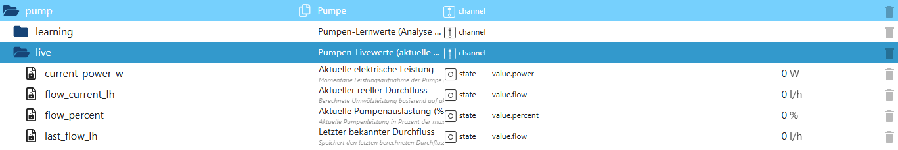

# Pumpen-Livewerte (pump.live)

Der Bereich **`pump.live`** stellt alle **aktuellen Live-Mess- und Berechnungswerte** der Poolpumpe bereit.  
Diese Daten spiegeln den **momentanen Betriebszustand** der Pumpe wider und werden kontinuierlich aktualisiert.

👉 Wichtig:  
`pump.live` ist **rein anzeigend**.  
Die Datenpunkte dienen der Visualisierung, Analyse und Diagnose – **nicht** der direkten Steuerung.

---

## Zweck des Live-Bereichs

Der Live-Bereich:

- zeigt den **aktuellen Stromverbrauch** der Pumpe
- stellt den **berechneten realen Durchfluss** bereit
- gibt die **momentane Pumpenauslastung** in Prozent an
- speichert den **letzten bekannten Durchfluss** bei Pumpenstopp
- bildet die Grundlage für:
  - Statistik
  - Lernwerte
  - Diagnose
  - Visualisierung

---

## Datenpunkte – Übersicht

*(Screenshot im Repository unter `docs/states/images/pump_live.png` ablegen)*

---

## Erklärung der Datenpunkte

### 🔹 Aktuelle Leistungswerte

#### `pump.live.current_power_w`
Aktuelle elektrische Leistungsaufnahme der Pumpe in Watt.

- Typ: `number`
- Einheit: `W`
- `0 W` → Pumpe aus

Dieser Wert stammt typischerweise von:
- einer Messsteckdose
- einem Leistungsmessgerät
- oder einem externen Energiesensor

---

#### `pump.live.flow_current_lh`
Aktuell berechneter realer Durchfluss der Pumpe in Liter pro Stunde.

- Typ: `number`
- Einheit: `l/h`

Der Wert wird **nicht gemessen**, sondern aus der aktuellen Leistungsaufnahme  
und den konfigurierten Pumpendaten berechnet.

---

#### `pump.live.flow_percent`
Aktuelle Auslastung der Pumpe in Prozent.

- `0 %` → Pumpe aus  
- `100 %` → Betrieb bei Nennleistung  

Der Prozentwert basiert auf dem Verhältnis von:

aktueller Leistung ↔ konfigurierte Maximalleistung

---

### 🔹 Letzter bekannter Wert

#### `pump.live.last_flow_lh`
Speichert den **letzten berechneten Durchfluss**, bevor die Pumpe abgeschaltet wurde.

Zweck:
- Anzeige sinnvoller Werte im Stillstand
- Visualisierung des letzten Betriebszustands
- Vergleich zwischen mehreren Pumpenläufen

Dieser Wert bleibt bestehen, bis ein neuer Pumpenlauf beginnt.

---

## Eigenschaften & Sicherheit

Der Live-Bereich:

- ist **read-only**
- arbeitet **vollständig eventbasiert**
- erzeugt **keine Steueraktionen**
- ist **nicht saisonabhängig**
- verursacht **keine zusätzlichen Schaltvorgänge**

Alle Werte werden automatisch aktualisiert,  
sobald sich relevante Eingangsgrößen ändern.

---

## Zusammenspiel mit anderen Modulen

Die Live-Werte werden genutzt von:

- `pump.learning` → Aufbau von Lernwerten
- Statistik-Modulen (Tage / Wochen / Monate)
- Diagnose- und Analysefunktionen
- Visualisierungen (VIS / VIS-2 / Dashboards)
- optionalen KI-Modulen

👉 `pump.live` bildet damit die **Datenbasis für das gesamte Pumpen-Monitoring**.

---

## Typische Anwendungsfälle

- Anzeige der aktuellen Pumpenleistung
- Visualisierung von Durchfluss & Auslastung
- Vergleich mehrerer Pumpenläufe
- Diagnose bei ungewöhnlichem Verhalten
- Transparente Darstellung im Dashboard

---

## Fazit

Der Bereich **`pump.live`** liefert eine **klare, transparente und jederzeit nachvollziehbare Sicht**  
auf den aktuellen Pumpenbetrieb.

Er ist die **Momentaufnahme** der Pumpe –  
und die Grundlage für Lernen, Analyse und intelligente Auswertung im gesamten PoolControl-System.
