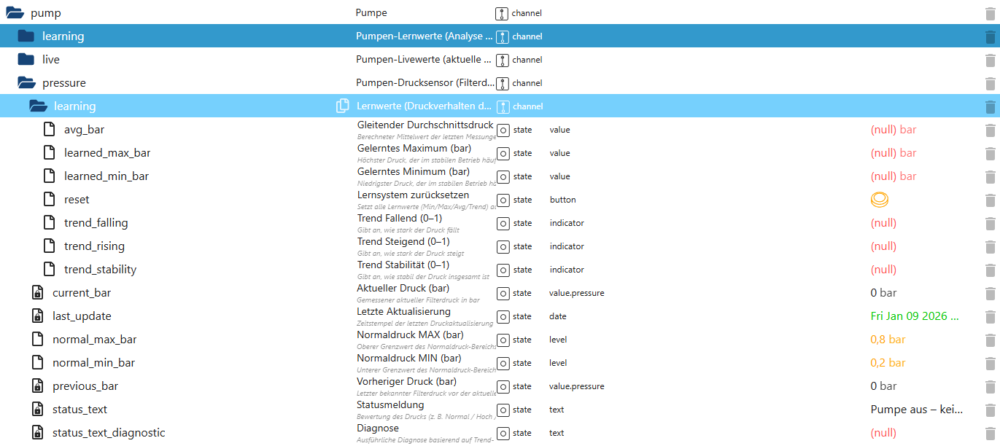

# Pumpen-Drucküberwachung (pump.pressure)

Der Bereich **`pump.pressure`** dient der **Überwachung, Analyse und Bewertung des Filterdrucks** der Poolpumpe.  
Er verarbeitet Messwerte eines angeschlossenen Drucksensors und stellt sowohl **Live-Werte** als auch **gelernte Druckverhalten** bereit.

👉 Wichtig:  
Der Druckbereich ist **rein analysierend und bewertend**.  
Er **steuert keine Aktoren**, sondern liefert Diagnose- und Zustandsinformationen.

---

## Zweck des Druckbereichs

Der Bereich `pump.pressure`:

- überwacht den **aktuellen Filterdruck**
- erkennt **Normal-, Unter- und Überdruck**
- analysiert **Drucktrends** (steigend / fallend / stabil)
- lernt das **typische Druckverhalten** der Anlage
- stellt **Status- und Diagnose-Texte** bereit
- dient als Grundlage für:
  - Wartungshinweise
  - Filterbewertung
  - spätere Diagnose- und KI-Funktionen

---

## Datenpunkte – Übersicht

*(Screenshot im Repository unter `docs/states/images/pump_pressure.png` ablegen)*

---

## Erklärung der Datenpunkte

## 🔹 Aktuelle Druckwerte

#### `pump.pressure.current_bar`
Aktueller gemessener Filterdruck in Bar.

- Typ: `number`
- Einheit: `bar`
- `0 bar` → Pumpe aus oder kein Messwert

---

#### `pump.pressure.previous_bar`
Vorheriger gemessener Druckwert.

Dient dem:
- Trendvergleich
- Erkennen von Druckänderungen zwischen Messzyklen

---

#### `pump.pressure.last_update`
Zeitstempel der letzten Druckaktualisierung.

- Typ: `date`
- rein informativ
- hilfreich für Diagnose und Monitoring

---

## 🔹 Normaldruck-Bereich

#### `pump.pressure.normal_min_bar`
Untergrenze des normalen Filterdruckbereichs.

---

#### `pump.pressure.normal_max_bar`
Obergrenze des normalen Filterdruckbereichs.

👉 Werte außerhalb dieses Bereichs werden als **auffällig**,  
aber **nicht automatisch als Fehler** bewertet.

---

## 🔹 Status & Bewertung

#### `pump.pressure.status_text`
Kurzbewertung des aktuellen Druckzustands.

Beispiele:
- „Druck im Normalbereich“
- „Filterdruck erhöht“
- „Druck unter Normalbereich“
- „Pumpe aus – kein Druck“

Ideal für:
- Dashboards
- VIS-Anzeigen
- schnelle Übersicht

---

#### `pump.pressure.status_text_diagnostic`
Ausführlichere Diagnose des Druckverhaltens.

Beispiele:
- Hinweise auf Filterverschmutzung
- ungewöhnliche Druckverläufe
- Kombination aus Trend- und Grenzwertbewertung

Dieser Text richtet sich an:
- fortgeschrittene Nutzer
- Diagnose-Ansichten
- spätere KI-Auswertungen

---

## 🔹 Trend-Erkennung

Die Trend-States zeigen **keine Ja/Nein-Information**,  
sondern eine **Intensität zwischen 0 und 1**.

---

#### `pump.pressure.trend_rising`
Zeigt, wie stark der Druck aktuell **ansteigt**.

- `0` → kein Anstieg
- `1` → starker, schneller Anstieg

---

#### `pump.pressure.trend_falling`
Zeigt, wie stark der Druck aktuell **abfällt**.

- `0` → kein Abfall
- `1` → starker Abfall

---

#### `pump.pressure.trend_stability`
Bewertet, wie **stabil** der Druck insgesamt ist.

- `0` → stark schwankend
- `1` → sehr stabiler Druck

---

## 🔹 Lernbereich – Druckverhalten (`pump.pressure.learning`)

Der Unterbereich **`pump.pressure.learning`** speichert **langfristige Lernwerte**  
über das typische Druckverhalten der Anlage.

👉 Auch dieser Bereich ist **rein passiv** und **nicht steuernd**.

---

### 🔹 Gelernte Druckreferenzen

#### `pump.pressure.learning.avg_bar`
Gleitender Durchschnittsdruck im normalen Betrieb.

- basiert auf mehreren Messzyklen
- glättet kurzzeitige Schwankungen

---

#### `pump.pressure.learning.learned_min_bar`
Erlernter minimaler Filterdruck im stabilen Betrieb.

---

#### `pump.pressure.learning.learned_max_bar`
Erlernter maximaler Filterdruck im stabilen Betrieb.

Diese beiden Werte beschreiben den **typischen Arbeitsbereich**  
der individuellen Poolanlage.

---

### 🔹 Lernsystem-Steuerung

#### `pump.pressure.learning.reset`
Setzt alle gelernten Druckwerte zurück.

Zurückgesetzt werden:
- Min-/Max-Werte
- Durchschnitt
- Trendgrundlagen

Typischer Einsatz:
- nach Filterwechsel
- nach Umbauten
- nach Sensorwechsel

---

## Eigenschaften & Sicherheit

Der Druckbereich:

- arbeitet **vollständig ereignisbasiert**
- greift **nicht in die Pumpensteuerung** ein
- erzeugt **keine automatischen Abschaltungen**
- ist **persistiert**
- übersteht Adapter-Updates
- bewertet Hinweise, **keine Fehler**

---

## Typische Anwendungsfälle

- Erkennen von Filterverschmutzung
- Beobachtung von Druckanstieg über Tage/Wochen
- Diagnose bei ungewöhnlichem Pumpenverhalten
- Wartungsplanung (z. B. Rückspülen)
- Anzeige des Filterzustands im Dashboard

---

## Wichtiger Hinweis

Ein erhöhter oder veränderter Druck ist **kein Fehler**,  
sondern ein **Hinweis auf den aktuellen Anlagenzustand**.

Die endgültige Interpretation liegt bewusst:
- beim Nutzer
- bei Diagnosemodulen
- oder bei späteren KI-Funktionen

---

## Fazit

Der Bereich **`pump.pressure`** erweitert PoolControl um eine **echte Druckanalyse**,  
die weit über einfache Grenzwerte hinausgeht.

Durch die Kombination aus:
- Live-Druck
- Trend-Erkennung
- Lernwerten

entsteht eine **intelligente, nachvollziehbare Filterdiagnose** –  
leise, sicher und ohne Eingriff in den Betrieb.
