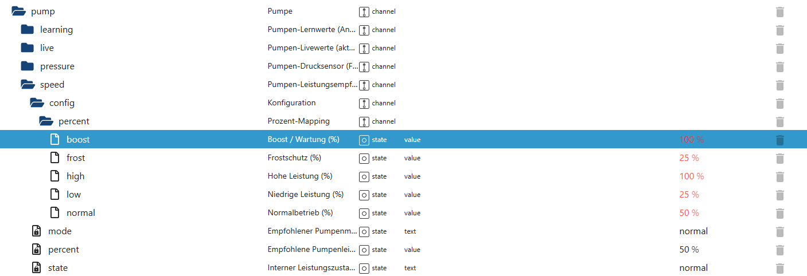

# Pumpen-Leistungsempfehlung (PumpSpeedHelper)

Der **PumpSpeedHelper** erweitert PoolControl um eine **intelligente, zustandsabhängige Leistungsempfehlung**  
für die Poolpumpe.

Er berechnet aus dem aktuellen Betriebszustand eine **empfohlene Pumpenleistung in Prozent**,  
ohne selbst aktiv in die Pumpensteuerung einzugreifen.

Die PumpSpeed-Logik arbeitet **rein unterstützend** und stellt eine zentrale Grundlage  
für externe Steuerungen, Visualisierungen und Automatisierungen bereit.

---

## Funktionsübersicht

Der PumpSpeedHelper:

- ermittelt einen **internen Leistungszustand** der Pumpe
- leitet daraus eine **empfohlene Leistung in Prozent** ab
- berücksichtigt **Betriebsmodi und Schutzfunktionen**
- arbeitet **ereignisbasiert**
- greift **nicht direkt** in die Pumpensteuerung ein
- stellt **konfigurierbare Prozentwerte** für verschiedene Betriebszustände bereit
- dient als **zentrale Empfehlungsschicht** für externe Systeme

---

## Typische Einsatzszenarien

- Frequenzumrichter mit externer Ansteuerung
- Drehzahlgeregelte Pumpen (z. B. 0–10 V, Modbus, Shelly)
- Blockly- oder Script-Logiken
- Visualisierung der empfohlenen Pumpenleistung
- Diagnose und Optimierung des Pumpenbetriebs

👉 Der PumpSpeedHelper **schaltet keine Pumpe**,  
sondern liefert ausschließlich eine **Empfehlung**.

---

## Datenpunkte – Übersicht

*(Screenshot im Repository unter `docs/states/images/` ablegen)*

---

## Erklärung der Datenpunkte

### 🔹 Steuerung & Status

#### `pump.speed.state`
Interner Leistungszustand der Pumpe.

Dieser State ist die **zentrale Entscheidungsbasis** des PumpSpeedHelpers  
und wird **ausschließlich intern** gesetzt.

Typische Werte:
- `off`
- `frost`
- `low`
- `normal`
- `high`
- `boost`

---

#### `pump.speed.mode`
Menschenlesbare Darstellung des aktuellen Leistungszustands.

Inhaltlich identisch zu `pump.speed.state`,  
gedacht für:
- Visualisierungen
- Diagnose
- einfache Auswertungen

---

#### `pump.speed.percent`
Empfohlene Pumpenleistung in Prozent (0–100 %).

Dieser Wert wird aus:
- dem internen Leistungszustand
- den konfigurierten Prozentwerten

berechnet.

👉 **Reiner Empfehlungwert**, keine direkte Steuerung.

---

### 🔹 Konfiguration – Prozent-Mapping

Die folgenden States definieren, **welche Prozentleistung**  
für die einzelnen Betriebszustände empfohlen wird.

#### `pump.speed.config.percent.normal`
Empfohlene Leistung im Normalbetrieb.

---

#### `pump.speed.config.percent.low`
Empfohlene Leistung bei niedriger Pumpenlast.

---

#### `pump.speed.config.percent.high`
Empfohlene Leistung bei erhöhter Pumpenlast.

---

#### `pump.speed.config.percent.frost`
Empfohlene Leistung im Frostschutzbetrieb.

---

#### `pump.speed.config.percent.boost`
Empfohlene Leistung im Boost- bzw. Wartungsbetrieb  
(z. B. Rückspülen, Sonderbetrieb).

Alle Konfigurationswerte:
- sind **persistiert**
- können frei angepasst werden
- wirken **nur auf die Empfehlung**, nicht auf die Steuerung

---

## Prioritäten & Sicherheit

Der PumpSpeedHelper:

- arbeitet **vollständig passiv**
- greift **nicht** in Pumpenmodi ein
- schaltet **keine Aktoren**
- erzeugt **keine Endlosschleifen**
- nutzt bestehende Zustände anderer Module
- ist **entkoppelt** von sicherheitskritischen Funktionen

---

## Zusammenspiel mit anderen Modulen

Der PumpSpeedHelper wertet u. a. Zustände aus von:

- Pumpensteuerung (`pump`)
- Frostschutz
- Wartungs- / Control-Helper
- Zeit- und Automatiklogiken

👉 Die eigentliche Umsetzung der Leistung  
erfolgt **außerhalb von PoolControl**.

---

## Fazit

Der PumpSpeedHelper ergänzt PoolControl um eine **klare, sichere und flexible Leistungsempfehlung**  
für moderne, regelbare Pumpensysteme.

Er ermöglicht eine saubere Trennung zwischen:
- **Logik & Bewertung**
- **Steuerung & Hardware**

und fügt sich vollständig in das bestehende Helper-Konzept ein.
