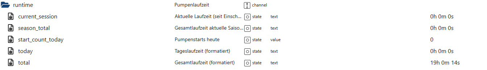

# Pumpenlaufzeiten (runtime)

Der Bereich **`runtime`** erfasst und visualisiert die **Laufzeiten der Poolpumpe**  
auf verschiedenen Zeitebenen. Er dient der **Transparenz**, **Analyse** und **Statistik**  
des realen Pumpenbetriebs.

👉 Wichtig:  
Der Runtime-Bereich ist **rein auswertend**.  
Er steuert **keine Funktionen** und greift **nicht** in den Pumpenbetrieb ein.

---

## Zweck des Runtime-Bereichs

Der Bereich `runtime`:

- misst die **aktuelle Laufzeit** eines Pumpenzyklus
- summiert **Tages-, Saison- und Gesamtlaufzeiten**
- zählt **Pumpenstarts pro Tag**
- stellt **formatierte Zeitwerte** bereit
- dient als Grundlage für:
  - Statistik
  - Optimierung der Umwälzung
  - Diagnose
  - Visualisierung

---

## Datenpunkte – Übersicht

*(Screenshot im Repository unter `docs/states/images/runtime.png` ablegen)*

---

## Erklärung der Datenpunkte

### 🔹 Aktueller Pumpenlauf

#### `runtime.current_session`
Aktuelle Laufzeit der Pumpe seit dem letzten Einschalten.

- Formatierter Text (z. B. `2h 14m 32s`)
- Wird bei jedem Pumpenstopp automatisch zurückgesetzt

Ideal für:
- Live-Anzeigen
- Dashboard-Status
- kurzfristige Beobachtung

---

### 🔹 Tageswerte

#### `runtime.today`
Gesamte Pumpenlaufzeit des aktuellen Tages.

- Formatierter Text
- Reset automatisch um Mitternacht

---

#### `runtime.start_count_today`
Anzahl der Pumpenstarts am heutigen Tag.

Hilfreich für:
- Erkennen von häufigem Takten
- Optimierung von Automatik-Logiken
- Diagnose ungewöhnlicher Schaltmuster

---

### 🔹 Langzeitwerte

#### `runtime.total`
Gesamte Pumpenlaufzeit seit Inbetriebnahme des Adapters.

- Formatierter Text
- Persistenter Wert
- Wird **nicht** automatisch zurückgesetzt

---

#### `runtime.season_total`
Gesamte Pumpenlaufzeit der aktuellen Poolsaison.

- Formatierter Text
- Wird beim Saisonwechsel zurückgesetzt
- Ermöglicht saisonale Auswertungen

---

## Eigenschaften & Sicherheit

Der Runtime-Bereich:

- ist **read-only**
- arbeitet **ereignisbasiert**
- erzeugt **keine Schaltaktionen**
- ist **vollständig entkoppelt** von der Steuerlogik
- ist **persistiert** (Langzeit- & Saisonwerte)

Alle Werte spiegeln den **realen Pumpenbetrieb** wider.

---

## Zusammenspiel mit anderen Modulen

Die Runtime-Daten werden genutzt von:

- Statistik- & Analyse-Modulen
- Diagnosefunktionen
- Visualisierungen (VIS / Dashboards)
- späteren KI- und Optimierungsfunktionen

👉 Besonders in Kombination mit:
- `pump.live`
- `pump.learning`
- Energie- und Verbrauchsdaten

entsteht ein **vollständiges Bild des Pumpenbetriebs**.

---

## Typische Anwendungsfälle

- Kontrolle der täglichen Umwälzzeit
- Vergleich von Saisonlaufzeiten
- Erkennen unnötiger Pumpenstarts
- Optimierung von Zeit- oder PV-Steuerung
- Transparente Darstellung im Dashboard

---

## Fazit

Der Bereich **`runtime`** macht den Pumpenbetrieb **messbar und nachvollziehbar**.  
Er liefert klare Zahlen statt Schätzungen und ist damit ein unverzichtbarer Baustein  
für Analyse, Optimierung und langfristige Transparenz im PoolControl-System.
