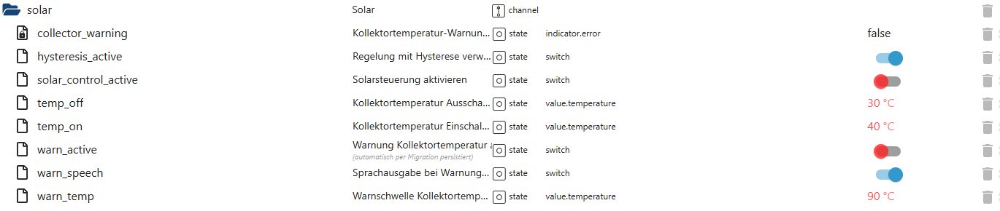

# Solarsteuerung (solar)

Der Bereich **`solar`** steuert die **thermische Solarunterstützung** für den Pool  
(z. B. Solarabsorber oder Kollektoren auf dem Dach).

Die Solarsteuerung entscheidet anhand von **Kollektortemperaturen**,  
ob Solarwärme sinnvoll genutzt werden kann, und schützt die Anlage  
gleichzeitig vor **Überhitzung**.

👉 Wichtig:  
Der Solarbereich steuert **keine Pumpe direkt**,  
sondern arbeitet **im Zusammenspiel mit der Pumpenlogik**.

---

## Zweck des Solar-Bereichs

Der Bereich `solar`:

- aktiviert oder deaktiviert die Solarsteuerung
- nutzt **Ein- und Ausschalttemperaturen** für den Kollektor
- unterstützt eine **Hysterese**, um Takten zu vermeiden
- überwacht **kritische Kollektortemperaturen**
- erzeugt **Warnungen und optionale Sprachausgaben**
- arbeitet vollständig **automatisch und ereignisbasiert**

---

## Datenpunkte – Übersicht

*(Screenshot im Repository unter `docs/states/images/solar.png` ablegen)*

---

## Erklärung der Datenpunkte

## 🔹 Aktivierung & Regelung

#### `solar.solar_control_active`
Aktiviert oder deaktiviert die komplette Solarsteuerung.

- `true` → Solarsteuerung aktiv  
- `false` → Solarsteuerung vollständig deaktiviert  

---

#### `solar.hysteresis_active`
Aktiviert die Regelung mit Hysterese.

- `true` → Ein-/Ausschaltpunkte arbeiten mit Abstand  
- `false` → direkte Umschaltung an den Grenzwerten  

Zweck:
- verhindert häufiges Ein- und Ausschalten
- sorgt für ruhigen Anlagenbetrieb

---

## 🔹 Temperaturgrenzen

#### `solar.temp_on`
Kollektortemperatur, ab der Solarwärme **eingeschaltet** wird.

Beispiel:
- `40 °C` → Solar aktiv ab 40 °C Kollektortemperatur

---

#### `solar.temp_off`
Kollektortemperatur, ab der Solarwärme **abgeschaltet** wird.

Beispiel:
- `30 °C` → Solar aus unterhalb von 30 °C

👉 Der Abstand zwischen `temp_on` und `temp_off` bildet die **Hysterese**.

---

## 🔹 Warn- & Schutzfunktionen

#### `solar.warn_active`
Aktiviert die Überwachung der Kollektortemperatur.

- `true` → Warnsystem aktiv  
- `false` → keine Temperaturwarnungen  

---

#### `solar.warn_temp`
Temperaturschwelle für eine Solar-Warnung.

Wird dieser Wert erreicht oder überschritten,  
gilt die Kollektortemperatur als **kritisch**.

---

#### `solar.collector_warning`
Statusanzeige für eine aktive Kollektortemperatur-Warnung.

- `true` → Warnung aktiv  
- `false` → alles im Normalbereich  

Dieser State ist **rein informativ**.

---

#### `solar.warn_speech`
Aktiviert eine **Sprachausgabe**, wenn eine Solar-Warnung auftritt.

- `true` → Sprachausgabe aktiv  
- `false` → keine Sprachmeldung  

Die Ausgabe erfolgt über das zentrale Sprachsystem.

---

## Eigenschaften & Sicherheit

Der Solarbereich:

- arbeitet **vollständig automatisch**
- ist **temperaturgeführt**
- erzeugt **keine Endlosschleifen**
- schützt die Anlage vor Überhitzung
- greift **nicht direkt** in die Pumpensteuerung ein
- ist klar vom PV-Überschuss-System getrennt

---

## Zusammenspiel mit anderen Modulen

Der Solarbereich arbeitet zusammen mit:

- Pumpensteuerung (`pump`)
- Temperaturüberwachung
- Sprachsystem (Warnmeldungen)
- Statistik- und Analysemodulen

👉 Die Solarsteuerung liefert **klare Zustände**,  
die von anderen Modulen sicher ausgewertet werden können.

---

## Typische Anwendungsfälle

- Automatische Nutzung von Solarwärme
- Schutz vor überhitzten Kollektoren
- Ruhiger Betrieb durch Hysterese
- Anzeige des Solarstatus im Dashboard
- Sprachausgabe bei kritischen Temperaturen

---

## Fazit

Der Bereich **`solar`** ermöglicht eine **sichere, automatische und temperaturbasierte Nutzung**  
von Solarwärme für den Pool.

Durch klare Grenzwerte, optionale Warnungen und saubere Integration  
bleibt die Solarsteuerung **effektiv, stabil und nachvollziehbar** –  
ohne unnötige Komplexität.
