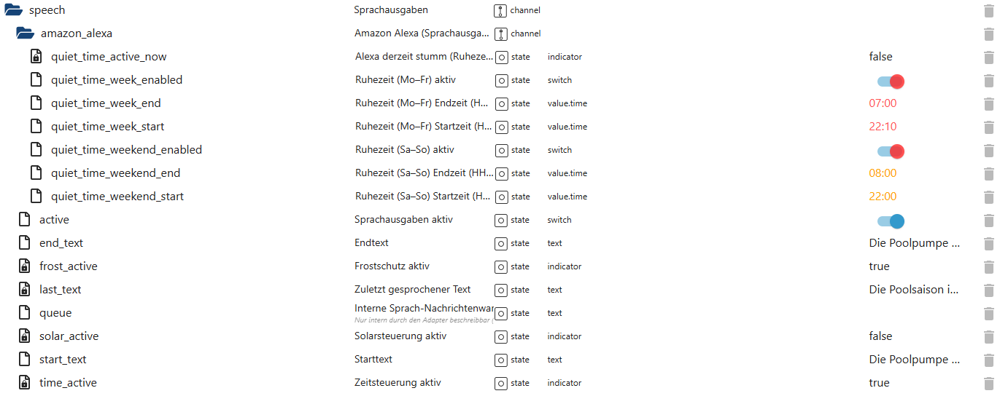

# Sprachausgaben & Sprachsystem (speech)

Der Bereich **`speech`** bündelt alle **Sprach- und Textausgaben** von PoolControl.  
Er fungiert als **zentrale Schnittstelle** zwischen interner Logik, Statusmeldungen  
und externen Sprachsystemen (z. B. Amazon Alexa).

👉 Wichtig:  
Der Speech-Bereich **entscheidet nicht selbst**,  
sondern gibt **bewusst erzeugte Texte** anderer Module aus.

---

## Zweck des Speech-Bereichs

Der Bereich `speech`:

- steuert, **ob** Sprachmeldungen ausgegeben werden
- verwaltet **Start-, End- und Status-Texte**
- speichert die **letzte gesprochene Meldung**
- verwaltet eine **interne Nachrichten-Warteschlange**
- berücksichtigt **Ruhezeiten**
- dient als **zentrale Ausgabeschicht** für:
  - Pumpenstatus
  - Solar
  - Frostschutz
  - Zeitsteuerung
  - Warnungen
  - Hinweise

---

## Datenpunkte – Übersicht

*(Screenshot im Repository unter `docs/states/images/speech.png` ablegen)*

---

## Erklärung der Datenpunkte

## 🔹 Aktivierung & Steuerung

#### `speech.active`
Aktiviert oder deaktiviert **alle Sprachausgaben** von PoolControl.

- `true` → Sprachsystem aktiv  
- `false` → keine Sprachausgaben  

Dieser Schalter wirkt **global**.

---

#### `speech.queue`
Interne Warteschlange für Sprachmeldungen.

- Typ: `string`
- **Nur intern beschreibbar**
- Wird von Helpern genutzt, um Texte an das Sprachsystem zu übergeben

👉 Dieser State ist **nicht zur manuellen Nutzung** gedacht.

---

## 🔹 Textbausteine

#### `speech.start_text`
Text, der beim **Start eines relevanten Ereignisses** gesprochen werden kann  
(z. B. Pumpenstart).

---

#### `speech.end_text`
Text, der beim **Ende eines Ereignisses** gesprochen werden kann  
(z. B. Pumpenstopp).

---

#### `speech.last_text`
Zuletzt tatsächlich ausgegebener Sprachtext.

- rein informativ
- ideal für Diagnose und Visualisierung

---

## 🔹 Status-Indikatoren

Diese States zeigen an, **welche Automatikfunktionen aktuell aktiv sind**  
und können zur Textbildung oder Visualisierung genutzt werden.

---

#### `speech.time_active`
Zeitsteuerung aktuell aktiv.

---

#### `speech.solar_active`
Solarsteuerung aktuell aktiv.

---

#### `speech.frost_active`
Frostschutz aktuell aktiv.

---

## 🔹 Ruhezeiten & Sprachunterdrückung (Amazon Alexa)

Der Unterbereich **`speech.amazon_alexa`** steuert **Ruhezeiten**  
für Sprachmeldungen über Amazon Alexa.

👉 Diese Logik beeinflusst **nur die Ausgabe**,  
nicht die Erzeugung der Texte.

---

### 🔹 Aktueller Ruhezeitstatus

#### `speech.amazon_alexa.quiet_time_active_now`
Zeigt an, ob aktuell eine Ruhezeit aktiv ist.

- `true` → Alexa momentan stumm  
- `false` → Sprachmeldungen erlaubt  

---

### 🔹 Ruhezeiten (Mo–Fr)

#### `speech.amazon_alexa.quiet_time_week_enabled`
Aktiviert Ruhezeiten für **Werktage (Montag–Freitag)**.

---

#### `speech.amazon_alexa.quiet_time_week_start`
Startzeit der Ruhezeit an Werktagen.

- Typ: `HH:MM`

---

#### `speech.amazon_alexa.quiet_time_week_end`
Endzeit der Ruhezeit an Werktagen.

- Typ: `HH:MM`

---

### 🔹 Ruhezeiten (Sa–So)

#### `speech.amazon_alexa.quiet_time_weekend_enabled`
Aktiviert Ruhezeiten für **Wochenenden (Samstag–Sonntag)**.

---

#### `speech.amazon_alexa.quiet_time_weekend_start`
Startzeit der Ruhezeit am Wochenende.

---

#### `speech.amazon_alexa.quiet_time_weekend_end`
Endzeit der Ruhezeit am Wochenende.

---

## Eigenschaften & Sicherheit

Der Speech-Bereich:

- ist **rein ausgabeseitig**
- greift **nicht steuernd** ein
- verändert **keine Systemzustände**
- berücksichtigt Nutzerkomfort (Ruhezeiten)
- ist vollständig **entkoppelt** von Logik-Helpern
- ist zentraler Sammelpunkt für **alle Sprachmeldungen**

---

## Typische Anwendungsfälle

- Sprachausgabe von Pumpenstarts/-stopps
- Hinweise bei Solar- oder Frostbetrieb
- Warnmeldungen bei kritischen Zuständen
- Ruhige Nachtzeiten ohne Sprachstörungen
- Diagnose der letzten Sprachausgabe

---

## Wichtiger Hinweis

Der Speech-Bereich **entscheidet nicht**,  
*was* gesagt wird – sondern nur **ob und wann**.

Die Textinhalte stammen immer aus:
- Helpern
- Statusmodulen
- Diagnose- oder Analysefunktionen

---

## Fazit

Der Bereich **`speech`** bildet die **zentrale, kontrollierte Sprachschnittstelle**  
von PoolControl.

Er sorgt dafür, dass wichtige Informationen:
- verständlich,
- gezielt,
- zur richtigen Zeit

ausgegeben werden –  
ohne den Betrieb zu beeinflussen oder zu stören.
