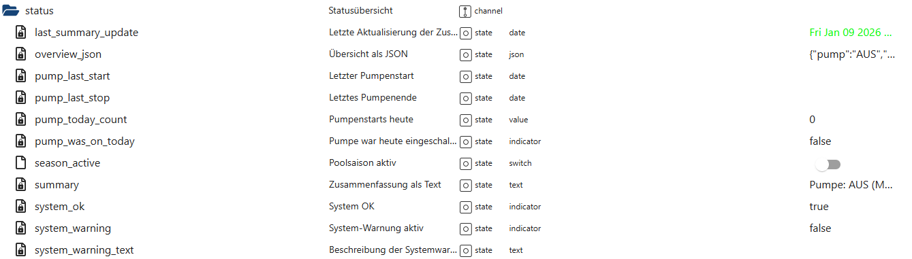

# Systemstatus & Übersicht (status)

Der Bereich **`status`** stellt eine **zentrale, zusammengefasste Systemübersicht**  
über den aktuellen Zustand von PoolControl bereit.

Er bündelt Informationen aus verschiedenen Modulen  
(Pumpe, Laufzeit, Solar, Frostschutz, Saisonstatus usw.)  
und bereitet sie **lesbar, kompakt und strukturiert** auf.

👉 Wichtig:  
Der Statusbereich ist **rein informativ**.  
Er steuert **keine Funktionen** und greift **nicht aktiv** in das System ein.

---

## Zweck des Status-Bereichs

Der Bereich `status`:

- fasst den **aktuellen Systemzustand** zusammen
- stellt **Zeitpunkte wichtiger Ereignisse** bereit
- liefert eine **menschenlesbare Kurzfassung**
- bietet eine **strukturierte JSON-Übersicht**
- signalisiert **Warnungen oder Probleme**
- dient als zentrale Anlaufstelle für:
  - Dashboards
  - VIS-Ansichten
  - Diagnose
  - externe Auswertungen

---

## Datenpunkte – Übersicht

*(Screenshot im Repository unter `docs/states/images/status.png` ablegen)*

---

## Erklärung der Datenpunkte

## 🔹 Aktualisierung & Zusammenfassung

#### `status.last_summary_update`
Zeitstempel der letzten Aktualisierung der Statusübersicht.

- Typ: `date`
- rein informativ

---

#### `status.summary`
Kurzfassung des aktuellen Systemzustands als Text.

Beispiel:
> „Pumpe: AUS (Manuell), Saison inaktiv“

Ideal für:
- Dashboards
- VIS-Statusanzeigen
- Sprachsysteme (indirekt)

---

#### `status.overview_json`
Strukturierte Gesamtübersicht im JSON-Format.

Enthält u. a.:
- Pumpenstatus
- Laufzeitinformationen
- Saisonstatus
- Warnungen
- Systemzustände

Dieser State ist ideal für:
- externe Skripte
- Visualisierungen
- API-ähnliche Nutzung

---

## 🔹 Pumpenbezogene Statusdaten

#### `status.pump_last_start`
Zeitpunkt des letzten Pumpenstarts.

---

#### `status.pump_last_stop`
Zeitpunkt des letzten Pumpenstopps.

---

#### `status.pump_today_count`
Anzahl der Pumpenstarts am heutigen Tag.

---

#### `status.pump_was_on_today`
Zeigt an, ob die Pumpe **heute bereits gelaufen** ist.

- `true` → Pumpe war heute aktiv  
- `false` → Pumpe war heute noch nicht aktiv  

---

## 🔹 Saison- & Systemzustand

#### `status.season_active`
Zeigt an, ob sich das System aktuell in der **Poolsaison** befindet.

- `true` → Saison aktiv  
- `false` → Saison inaktiv  

Viele Automatikfunktionen berücksichtigen diesen Zustand.

---

#### `status.system_ok`
Gesamtindikator für den Systemzustand.

- `true` → System arbeitet ohne erkannte Probleme  
- `false` → mindestens eine relevante Warnung aktiv  

---

#### `status.system_warning`
Zeigt an, ob aktuell eine **Systemwarnung** vorliegt.

- `true` → Warnung aktiv  
- `false` → kein Warnzustand  

---

#### `status.system_warning_text`
Beschreibung der aktuellen Systemwarnung.

Beispiele:
- Temperaturwarnung
- Druckauffälligkeit
- Sensorproblem

Dieser Text ist **menschenlesbar** und dient der Diagnose.

---

## Eigenschaften & Sicherheit

Der Status-Bereich:

- ist **read-only**
- arbeitet **ereignisbasiert**
- greift **nicht steuernd** ein
- verändert **keine Systemzustände**
- ist vollständig **entkoppelt** von Steuer-Helpern
- dient als **single source of truth** für Übersichten

---

## Zusammenspiel mit anderen Modulen

Der Statusbereich sammelt Informationen aus:

- Pumpensteuerung
- Runtime
- Solar
- Frostschutz
- Druck- & Lernsystemen
- Sicherheits- und Diagnosemodulen

👉 Er bewertet nicht selbst,  
sondern **fasst bestehende Zustände zusammen**.

---

## Typische Anwendungsfälle

- Zentrale Systemübersicht
- VIS-Dashboard-Hauptanzeige
- Schnelle Diagnose
- JSON-Auswertung in Skripten
- Statusanzeige für Sprachsysteme

---

## Fazit

Der Bereich **`status`** ist das **zentrale Informationsfenster** von PoolControl.  
Er macht komplexe Systemzustände verständlich, übersichtlich und auswertbar –  
ohne selbst in den Betrieb einzugreifen.

Ein ruhiger, verlässlicher Überblick über das gesamte System.
